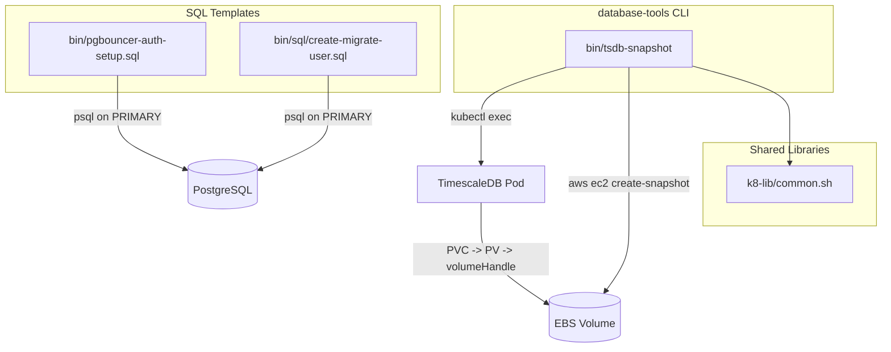

# Project Architecture

## Overview

**database-tools** is a collection of CLI utilities and SQL templates for managing TimescaleDB and PostgreSQL infrastructure on Kubernetes. It provides EBS snapshot automation, PgBouncer authentication setup, and migration user provisioning -- all designed for a primary/standby Postgres topology with AWS EBS-backed persistent volumes.

## System Diagram

## Core Components

| Component | Purpose |
|-----------|---------|
| `bin/tsdb-snapshot` | EBS snapshot of TimescaleDB volume with optional app-consistent mode via `pg_backup_start/stop` |
| `bin/pgbouncer-auth-setup.sql` | Creates PgBouncer auth user with `SECURITY DEFINER` credential lookup and a read-only application user |
| `bin/sql/create-migrate-user.sql` | Provisions a migration role with DDL privileges scoped to application and public schemas |
| `Makefile` | Installs `tsdb-snapshot` to `~/.local/bin`; SQL files are manual-copy templates |

## Key Design Decisions

- **Crash-consistent by default**: `tsdb-snapshot` takes crash-consistent EBS snapshots (safe for standbys via WAL replay). App-consistent mode (`--consistent`) is opt-in for promoted primaries only.
- **Least-privilege SQL roles**: PgBouncer auth user has no superuser; reads `pg_shadow` through a `SECURITY DEFINER` function. Migrate user inherits `postgres` only for index creation on existing tables.
- **Template-based SQL**: SQL files use `${VARIABLE}` placeholders rather than dynamic generation -- operator reviews and customizes before execution.

## Dependencies

| Dependency | Purpose |
|------------|---------|
| `k8-lib/common.sh` | Shared shell functions (`step`, `ok`, `die`, `warn`, color codes) |
| `kubectl` | Pod discovery, `exec` for `psql` commands |
| `aws` CLI | EBS snapshot creation and tagging |
| `psql` | SQL template execution (run manually by operator) |

## Environment Configuration

`tsdb-snapshot` reads configuration from environment variables with sensible defaults:

| Variable | Default | Purpose |
|----------|---------|---------|
| `K8_NAMESPACE` | `default` | Kubernetes namespace |
| `K8_TSDB_LABEL` | `timescaledb` | Pod selector label value |
| `AWS_DEFAULT_REGION` / `K8_AWS_REGION` | `us-east-1` | AWS region for snapshot |
| `K8_TSDB_SNAPSHOT_NAME` | `timescaledb-snapshot` | Snapshot name tag |
| `K8_DB_NAME` | `postgres` | Database name for backup start/stop |
