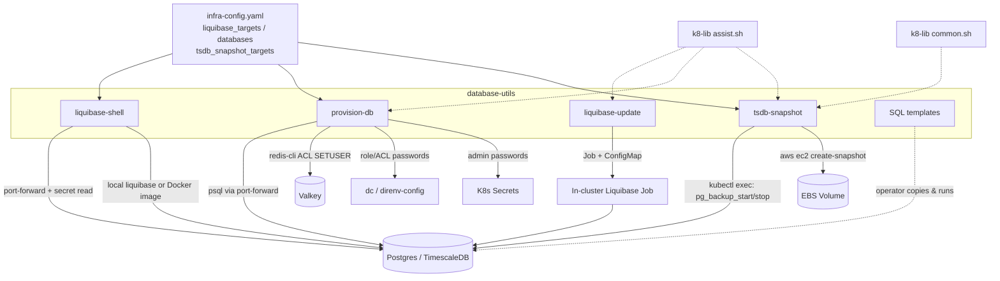

# Project Architecture

## Overview

**database-utils** is a Bash/SQL utility package for operating K8s-hosted
PostgreSQL/TimescaleDB (and optional Valkey/Redis) in the Noizu monorepo. Four
CLIs cover day-to-day DB ops:

| Concern | Tool |
|---------|------|
| Interactive / one-shot Liquibase via local port-forward | `liquibase-shell` |
| Legacy one-shot in-cluster Liquibase Job (gnp-backend only) | `liquibase-update` |
| Create DB + login role (+ optional Valkey ACL) on a *live* instance | `provision-db` |
| App-consistent EBS snapshot of a TimescaleDB volume | `tsdb-snapshot` |

Plus hand-run SQL templates for PgBouncer auth and migrate roles.

Config lives outside this package in monorepo `infra-config.yaml` /
`.infra-config.yaml`: Liquibase/provision tools read `liquibase_targets` and/or
`databases`; snapshots read `tsdb_snapshot_targets`. Field-level config
reference: [PROJ-SCHEMA.md](PROJ-SCHEMA.md). Install:
`make install` → `~/.local/bin` (also via repo-root `make install-utilities`).
Dual path: `Portfolio/Utilities/source/database-utils` ↔
`utilities/database/database-utils`.

## System Diagram

```mermaid
graph TB
    subgraph "database-utils"
        LS[liquibase-shell]
        LU[liquibase-update]
        PD[provision-db]
        TS[tsdb-snapshot]
        SQL[SQL templates]
    end

    CFG["infra-config.yaml<br/>liquibase_targets / databases<br/>tsdb_snapshot_targets"]
    CFG --> LS
    CFG --> PD
    CFG --> TS

    LS -->|port-forward + secret read| PG[(Postgres / TimescaleDB)]
    LS -->|local liquibase or Docker image| PG
    LU -->|Job + ConfigMap| JOB[In-cluster Liquibase Job]
    JOB --> PG
    PD -->|psql via port-forward| PG
    PD -->|redis-cli ACL SETUSER| VK[(Valkey)]
    PD -->|role/ACL passwords| DC[dc / direnv-config]
    PD -->|admin passwords| KSEC[K8s Secrets]
    TS -->|kubectl exec: pg_backup_start/stop| PG
    TS -->|aws ec2 create-snapshot| EBS[(EBS Volume)]
    SQL -.->|operator copies & runs| PG

    ASSIST[k8-lib assist.sh] -.-> LU & PD & TS
    COMMON[k8-lib common.sh] -.-> TS
```

## Core Components

| Component | Purpose |
|-----------|---------|
| `bin/liquibase-shell` | Port-forward + secret-sourced creds; interactive menu, `target -- <cmd>`, or `--shell` env export. Prefer local `liquibase`; Docker `liquibase/liquibase:4.29` fallback. Safety modes + `--yes` / `LIQUIBASE_ASSUME_YES` |
| `bin/liquibase-update` | Hardcoded gnp-backend Job (`namespace=gnp`, image tag overridable via `LIQUIBASE_TAG`); `--dry-run` → `update-sql`. No infra-config |
| `bin/provision-db` | Idempotent `CREATE DATABASE` / role + grants (+ optional extensions); optional Valkey `ACL SETUSER` when `redis_password_dc` set. Flags: `--dry-run`, `--redis-only`, `--skip-redis` / `--db-only`, `--list` |
| `bin/tsdb-snapshot` | Primary check → session-scoped `pg_backup_start` → EBS snapshot (wait complete) → `pg_backup_stop`. `--crash-only` or target `crash_only: true` for standbys |
| `bin/pgbouncer-auth-setup.sql` | Template: PgBouncer `auth_user` + `SECURITY DEFINER` `pgbouncer.get_auth()` + read-only app user |
| `bin/sql/create-migrate-user.sql` | Template: migrate role with schema/public DML + DDL + `GRANT postgres` for ownership |
| `Makefile` | `install`: symlink shell tools, *copy* `tsdb-snapshot`; SQL not installed. `compile`/`test` no-ops |

## liquibase-shell

Resolves config first-match: `$LIQUIBASE_CONFIG` → cwd / git-root
`infra-config.yaml` / `.infra-config.yaml` → walk-up. Target map: non-empty
`liquibase_targets`, else `databases`. Required target fields: namespace, service,
ports, `db_type`, secret name/key; `db_name` or `db_name_key`; `username` or
`username_key`. Secret/username/db-name keys support fallbacks lists. Optional
changelog → instance-level connection shell unless `--changelog-file` supplied.

Defaults `KUBECONFIG` to `~/.kube/noizu/config` when unset. EXIT/INT/TERM trap
kills port-forward and temp liquibase.properties dir.

**Safety:** `safety: readonly` blocks non-whitelist cmds; `destructive` confirms
`update` / rollback / `drop-all` / `clear-checksums` unless `--yes`.

→ Full behavior: [liquibase-shell-spec.md](liquibase-shell-spec.md)

## provision-db

Closes the “initdb.d only runs on first empty data dir” gap: apps added later
get DB/role (and optional Valkey ACL) on demand. Reuses the same target block as
Liquibase (`databases` preferred via yq `//`, else `liquibase_targets`) plus
provisioning fields (`role_password_dc`, optional `role_user_dc`, `admin_*`,
`extensions`, `redis_*`).

**Credentials:** role/ACL passwords from `dc` (same values Infisical syncs to
app secrets); superuser / Valkey default-user from live K8s admin secrets (not
pinned in dc). Live `ACL SETUSER` is lost on Valkey pod restart — durable path
is chart/`acl_users` in TF.

Also defaults `KUBECONFIG` to noizu config; dual port-forward cleanup trap.

## tsdb-snapshot

Named targets under `tsdb_snapshot_targets` via k8-lib merged-config walker
(`--config` is a **target name**, not a file path). Requires `k8-lib`
(`common.sh` + `assist.sh`) at `~/.local/share/k8-lib`.

Consistent path: verify `pg_is_in_recovery=f`, keep one `kubectl exec` psql
session (FIFO) for session-scoped non-exclusive backup, `pg_backup_start`
(`fast=false`, wait up to `K8_TSDB_PSQL_WAIT_SECS` default 900s), resolve
PVC→PV→EBS `volumeHandle`, `aws ec2 create-snapshot` + tags, wait until
snapshot `completed` (optional `K8_TSDB_SNAPSHOT_TIMEOUT`), then
`pg_backup_stop`. EXIT/INT/TERM always releases backup mode; dropped session
auto-aborts non-exclusive backup.

## Key Design Decisions

- **Config-driven topology**: new DB targets are YAML, not script edits;
  per-project overrides via `$LIQUIBASE_CONFIG` / search order.
- **Local tooling vs in-cluster Job**: shell/provision use port-forward for
  operator interactivity; `liquibase-update` is a narrow legacy gnp path.
- **Split credential model** (`provision-db`): declared app secrets via `dc`;
  drifting instance-admin secrets from the live cluster.
- **App-consistent snapshots by default**: crash-only is opt-in (standbys /
  recovery volumes cannot run `pg_backup_start`).
- **SQL as templates only**: `${VAR}` placeholders; never installed; run on
  primary after operator review.
- **Safety rails**: noizu `KUBECONFIG` default on shell tools; Liquibase safety
  gates; cleanup traps for port-forwards and backup mode.

## Dependencies

| Dependency | Used by |
|------------|---------|
| `kubectl` | all CLIs |
| `yq` (v4+) | config parsing (shell, provision, snapshot) |
| `liquibase` or Docker | `liquibase-shell` |
| `psql` | `provision-db`; optional in `--shell`; snapshot via `kubectl exec` |
| `redis-cli` | `provision-db` Valkey path |
| `nc` | port-forward readiness |
| `dc` (direnv-config) | `provision-db` role/ACL passwords |
| `aws` CLI | `tsdb-snapshot` |
| `k8-lib` assist | `liquibase-update`, `provision-db`, `tsdb-snapshot` (`--assist`) |
| `k8-lib` common | `tsdb-snapshot` only (merged config, `step`/`ok`/`die`) |

## Ecosystem Fit

Part of Noizu Infra DevOps utilities (install with other `utilities/*` tools).
Shares monorepo `.infra-config.yaml` conventions with `docker-build` /
`helm-upgrade` / `deploy-service`, and the secrets flow **dc → Infisical → K8s
Secrets**. Liquibase targets map to changelogs under portfolio apps; snapshot
targets map to TimescaleDB PVCs on AWS EBS.
