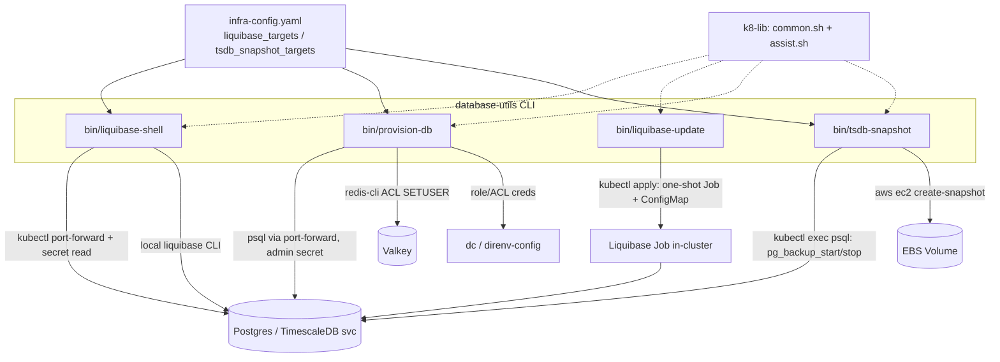

# Project Architecture

## Overview

**database-utils** is a terminal utility package: CLI tools and SQL templates for
administering K8s-hosted PostgreSQL/TimescaleDB (and Valkey/Redis) instances in the
Noizu infrastructure. It covers four concerns: interactive/one-shot Liquibase
migrations through kubectl port-forwards (`liquibase-shell`), a legacy one-shot
Liquibase K8s Job (`liquibase-update`), on-demand database/role/ACL-user
provisioning on running instances (`provision-db`), and app-consistent EBS
snapshots of TimescaleDB volumes (`tsdb-snapshot`).

All tools are config-driven off the repo's `infra-config.yaml` /
`.infra-config.yaml` (the monorepo's single source of build/deploy metadata):
`liquibase-shell` and `provision-db` read `liquibase_targets`, `tsdb-snapshot`
reads `tsdb_snapshot_targets`. Tools install to `~/.local/bin` via `make install`
(part of the wider `make install-utilities` flow) and source the shared `k8-lib`
(`~/.local/share/k8-lib`) for common helpers and `--assist` AI help.

## System Diagram

```mermaid
graph TB
    subgraph "database-utils CLI"
        LS[bin/liquibase-shell]
        LU[bin/liquibase-update]
        PD[bin/provision-db]
        TS[bin/tsdb-snapshot]
    end

    CFG[infra-config.yaml<br/>liquibase_targets / tsdb_snapshot_targets] --> LS
    CFG --> PD
    CFG --> TS

    LS -->|kubectl port-forward + secret read| PG[(Postgres / TimescaleDB svc)]
    LS -->|local liquibase CLI| PG
    LU -->|kubectl apply: one-shot Job + ConfigMap| JOB[Liquibase Job in-cluster]
    JOB --> PG
    PD -->|psql via port-forward, admin secret| PG
    PD -->|redis-cli ACL SETUSER| VK[(Valkey)]
    PD -->|role/ACL creds| DC[dc / direnv-config]
    TS -->|kubectl exec psql: pg_backup_start/stop| PG
    TS -->|aws ec2 create-snapshot| EBS[(EBS Volume)]

    LIB[k8-lib: common.sh + assist.sh] -.-> LS & LU & PD & TS
```

## Core Components

| Component | Purpose |
|-----------|---------|
| `bin/liquibase-shell` | Interactive/one-shot Liquibase against K8s DBs: port-forward, secret-sourced creds, menu / `-- <cmd>` / `--shell` env-export modes |
| `bin/liquibase-update` | Legacy one-shot in-cluster Liquibase update Job for the gnp-backend schema (hardcoded target; no Helm hook needed) |
| `bin/provision-db` | Create Postgres DB + login role (and optional Valkey ACL user) on a *running* instance — covers apps added after initdb ran |
| `bin/tsdb-snapshot` | App-consistent EBS snapshot of a TimescaleDB volume, bracketed by `pg_backup_start/stop`; `--crash-only` skips the bracket |
| `bin/pgbouncer-auth-setup.sql` | Template: PgBouncer auth user with `SECURITY DEFINER` credential lookup + read-only app user |
| `bin/sql/create-migrate-user.sql` | Template: migration role with DDL privileges scoped to app/public schemas |
| `Makefile` | `make install` → symlinks liquibase-shell/liquibase-update/provision-db, copies tsdb-snapshot to `~/.local/bin` |

## liquibase-shell

Resolves config (`$LIQUIBASE_CONFIG` → cwd → repo-root, `infra-config.yaml` then
`.infra-config.yaml`), port-forwards the target service, fetches credentials from
K8s secrets (with key fallbacks), and runs local `liquibase` against the forward.
`--shell` exports `LB_DEFAULTS_FILE`, `PG*` vars, `LB_CHANGELOG_PATH/DIR` while
keeping the forward alive; instance-level targets without a changelog act as
connection shells. Defaults `KUBECONFIG` to `~/.kube/noizu/config`.

→ *See [liquibase-shell-spec.md](liquibase-shell-spec.md) for the full spec*

## provision-db

Solves the "running instance never re-runs initdb.d" gap: apps (or Valkey ACL
users) added after first init get their database/role/ACL created on demand.
Credential model mirrors the cluster: role/ACL passwords come from `dc`
(direnv-config, the declarative source that syncs to K8s secrets via Infisical);
superuser/default-user passwords come from the live K8s admin secret (not pinned
in dc). Reuses `liquibase_targets.<target>` plus optional provisioning fields
(`role_password_dc`, `admin_secret`, `redis_*`). Note: live `ACL SETUSER` on
app-valkey is lost on pod restart — durable fix is the chart's `--user` args.

## tsdb-snapshot

Named targets under `tsdb_snapshot_targets` (resolved via k8-lib's merged-config
walker). Consistent mode verifies the pod is a primary, runs `pg_backup_start`
(fast=false, waits for a spread checkpoint — generous inline wait, default 900s),
snapshots the EBS volume behind the PVC via `aws ec2 create-snapshot`, then
`pg_backup_stop`. An exit/signal trap always releases backup mode; the
non-exclusive backup also auto-aborts if the psql session drops. Standby volumes:
`--crash-only` (or `crash_only: true` on the target).

## Key Design Decisions

- **Config-driven targets, not flags**: connection topology lives in
  `.infra-config.yaml` (monorepo convention) so new targets need no script edits
  and teams can carry per-project overrides.
- **Port-forward + local tooling** (`liquibase-shell`, `provision-db`) vs
  **in-cluster Job** (`liquibase-update`): the shell tools favor operator
  interactivity; the Job variant is the legacy path kept for the gnp target.
- **App-consistent snapshots by default**: crash-only is opt-in, since restoring
  an unbracketed snapshot of a busy primary risks longer recovery.
- **Split credential sourcing** (`provision-db`): declared creds from dc,
  drifting instance-admin creds from the live K8s secret.
- **Template-based SQL**: `${VARIABLE}` placeholders, operator reviews and
  customizes before running on the primary; `make install` never deploys them.
- **Safety rails**: `KUBECONFIG` defaults to the noizu cluster; cleanup traps
  kill port-forwards and release Postgres backup mode on any exit.

## Dependencies

| Dependency | Purpose |
|------------|---------|
| `k8-lib` (`common.sh`, `assist.sh`) | Shared shell helpers (`step`/`ok`/`die`), merged-config resolution, `--assist` AI help |
| `kubectl` | Port-forwards, secret reads, `exec`, Job creation |
| `liquibase` | Local CLI for `liquibase-shell` |
| `yq` (v4+) | YAML config parsing |
| `aws` CLI | EBS snapshot creation/tagging (`tsdb-snapshot`) |
| `dc` (direnv-config) | Declarative credential source (`provision-db`) |
| `psql` / `redis-cli` / `nc` | DB ops, ACL setup, port-forward readiness checks |

## Ecosystem Fit

Lives at `utilities/database/database-utils` in the Noizu Infra monorepo; installed
alongside the other DevOps utilities by the repo-root `make install-utilities`.
Consumes the same `.infra-config.yaml` conventions as `docker-build`,
`helm-upgrade`, and `deploy-service`, and the same secrets flow
(dc → Infisical → K8s Secrets) documented in the repo root.
