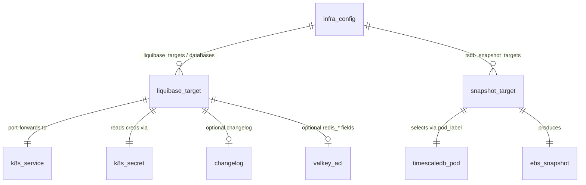

# Project Schema — database-utils

> **No persistence layer.** This package is a set of CLI database *administration*
> tools — it defines **no database of its own**: no SQL schema, no migrations, no
> models, no state files. The artifacts documented below are (1) configuration
> structures it *consumes* from the monorepo's `.infra-config.yaml`, and
> (2) SQL *reference templates* it ships for operators to run against target
> databases. Any tables/columns in those templates describe **remote target
> databases**, not this project's data model.

Plain tree: [PROJ-LAYOUT.summary.md](PROJ-LAYOUT.summary.md).
Arch: [PROJ-ARCH.md](PROJ-ARCH.md).

## 1. Configuration artifacts (consumed, not owned)

Resolved from `$LIQUIBASE_CONFIG` → `./infra-config.yaml` → git-root
`.infra-config.yaml` variants (see README). Parsed with `yq`.

### `liquibase_targets` / `databases` (first non-empty wins)

Used by `liquibase-shell`, `liquibase-update`, `provision-db`. Map of target-name → fields:

| Field | Required | Default | Description |
|-------|----------|---------|-------------|
| `namespace` | yes | — | k8s namespace of the DB service |
| `service` | yes | — | k8s service to port-forward (e.g. `svc/shared-postgres`) |
| `remote_port` | no | `5432` | DB port on the service |
| `local_port` | no | `55432`/`54320` | Local port-forward endpoint |
| `db_type` | yes | — | `postgresql` / `mysql` |
| `db_name` | yes | — | Database name |
| `schema` | no | `public` | Default schema |
| `secret_name` | yes | — | k8s Secret holding DB credentials |
| `username_key` (+`username_key_fallbacks`) | yes | — | Secret key for username (fallback list tried in order) |
| `secret_key` (+`secret_key_fallbacks`) | yes | — | Secret key for password |
| `safety` | no | — | e.g. `destructive` (extra confirm gates) |
| `changelog_dir` / `changelog_file` | no | — | Liquibase changelog path; omit ⇒ connection-only shell |
| `role_user_dc` / `role_password_dc` | `--db` only | — | `dc` addresses for provision-db role creds |
| `redis_*` fields (`redis_password_dc`, `redis_service`, `redis_user`, `redis_namespace`, `redis_port`, `redis_local_port`, `redis_acl_rules`, `redis_admin_secret`, `redis_admin_password_key`, `redis_admin_namespace`) | no | `svc/app-valkey`, `+@all`, `app-valkey-secrets`, … | Optional Valkey ACL provisioning (provision-db) |

### `tsdb_snapshot_targets`

Used by `tsdb-snapshot` (`--config <name>` selects a target, not a file). Map of target-name → fields:

| Field | Required | Default | Description |
|-------|----------|---------|-------------|
| `description` | no | — | Shown in target listing |
| `namespace` | no | `gnp` | Namespace of the TimescaleDB pod |
| `pod_label` | no | `timescaledb` | Pod selector label |
| `snapshot_name` | no | `timescaledb-snapshot` | EBS snapshot name prefix |
| `db_name` | no | `postgres` | Database for backup bracket |
| `crash_only` | no | `false` | Skip pg_backup_start/stop bracket |

### Environment variables

| Var | Consumer | Purpose |
|-----|----------|---------|
| `LIQUIBASE_CONFIG` | liquibase-shell | Override config file search |
| `LIQUIBASE_ASSUME_YES` | liquibase-shell | Skip destructive confirms (agent/CI) |
| `K8_LIB_DIR` | all | Override `~/.local/share/k8-lib` helper location |
| `INFRA_ROOT` | tsdb-snapshot | Config-search root (default cwd) |
| `K8_TSDB_PSQL_WAIT_SECS` | tsdb-snapshot | pg_backup_start wait budget (default 900s) |
| `KUBECONFIG` | all | liquibase-shell defaults to `~/.kube/noizu/config` if unset |

`liquibase-shell --shell` **exports** to the child shell: `LB_DEFAULTS_FILE`,
`PGHOST`, `PGPORT`, `PGDATABASE`, `PGUSER`, `PGPASSWORD`,
`LB_CHANGELOG_PATH`, `LB_CHANGELOG_DIR` (empty for connection-only targets).

### State files

None. Port-forwards are process-scoped; no caches, locks, or on-disk state are
written by any tool in this package.

## 2. SQL reference templates (DDL applied to *remote* targets)

These are copy-and-customize templates — not run by `make install` and not part
of any project-owned schema.

### `bin/pgbouncer-auth-setup.sql` — objects it creates

| Object | Kind | Notes |
|--------|------|-------|
| `${DB_PGBOUNCER_USER}` | ROLE | LOGIN, NOSUPERUSER; pgbouncer auth_user; only executes `get_auth()` |
| `pgbouncer` | SCHEMA | AUTHORIZATION postgres |
| `pgbouncer.get_auth(TEXT)` | FUNCTION | SECURITY DEFINER; returns `(usename, passwd)` from `pg_shadow`; EXECUTE revoked from PUBLIC, granted to auth user |
| `${DB_READONLY_USER}` | ROLE | LOGIN, SELECT-only via table/sequence + default privileges |

Run on PRIMARY only (replicates via WAL). Placeholders: `${DB_PGBOUNCER_USER}`, `${DB_READONLY_USER}`, `${DB_NAME}`.

### `bin/sql/create-migrate-user.sql` — objects/grants it creates

| Object | Kind | Notes |
|--------|------|-------|
| `${DB_MIGRATE_USER}` | ROLE | Idempotent (DO block); LOGIN |
| `${DB_SCHEMA}` | SCHEMA | CREATED if missing; USAGE+CREATE to migrate role |
| grants | PRIVILEGES | CRUD on `${DB_SCHEMA}` + `public` tables/sequences (+ default privileges); `CREATE` on database; `GRANT postgres … WITH INHERIT` for ownership |
| role setting | GUC | `search_path = ${DB_SCHEMA}, public` |

Password set post-run from Infisical (`MIGRATE_DB_PASSWORD`).

## 3. Config-shape ERD (conceptual, no tables)



<details><summary>PlantUML (same model)</summary>

```plantuml
@startuml
skinparam linetype ortho

TABLE(infra_config) {
  * name : TEXT <<PK>>
  --
  kind : TEXT
}

TABLE(liquibase_target) {
  * name : TEXT <<PK>>
  --
  namespace : TEXT
  service : TEXT
  db_type : TEXT
  changelog_file : TEXT
}

TABLE(snapshot_target) {
  * name : TEXT <<PK>>
  --
  namespace : TEXT
  pod_label : TEXT
  crash_only : BOOL
}

infra_config ||--o{ liquibase_target : "liquibase_targets/databases"
infra_config ||--o{ snapshot_target : "tsdb_snapshot_targets"
@enduml
```

</details>

## Maintenance notes

- Update §1 whenever target-field parsing changes in `bin/liquibase-shell`,
  `bin/provision-db`, or `bin/tsdb-snapshot` (grep `cfg "` / `yq eval`).
- Update §2 only if the SQL templates change (they describe target databases).
- If the package ever gains real persistence (its own DB/state), replace this
  file's no-persistence note and document the schema here.
