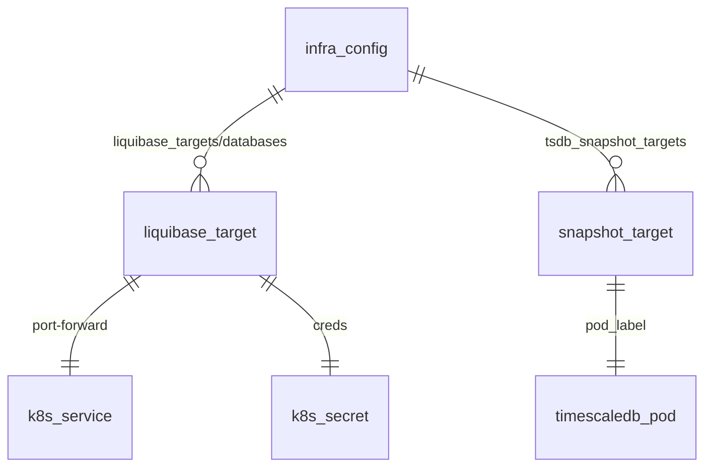

# Project Schema — Summary

**No persistence layer.** CLI DB-admin tool package: no own DB/schema/state.
Full detail: [PROJ-SCHEMA.md](PROJ-SCHEMA.md).

## Consumed config (external `.infra-config.yaml` / `$LIQUIBASE_CONFIG`)

- `liquibase_targets` / `databases` — k8s service + secret-key mapping per target;
  optional changelog, `role_*_dc`, `redis_*` fields. Consumers: liquibase-shell, liquibase-update, provision-db.
- `tsdb_snapshot_targets` — namespace/pod_label/snapshot name/`crash_only` per target. Consumer: tsdb-snapshot.
- Env: `LIQUIBASE_CONFIG`, `LIQUIBASE_ASSUME_YES`, `K8_LIB_DIR`, `INFRA_ROOT`, `K8_TSDB_PSQL_WAIT_SECS`, `KUBECONFIG`.
- `--shell` exports: `LB_DEFAULTS_FILE`, `PGHOST/PORT/DATABASE/USER/PASSWORD`, `LB_CHANGELOG_PATH/DIR`.
- State files: **none**.

## Shipped SQL templates (DDL on remote targets, not owned)

- `bin/pgbouncer-auth-setup.sql` → role (pgbouncer auth_user) + `pgbouncer` schema + `get_auth()` SECURITY DEFINER fn + read-only role.
- `bin/sql/create-migrate-user.sql` → migrate role + app schema grants + `search_path`; idempotent.

